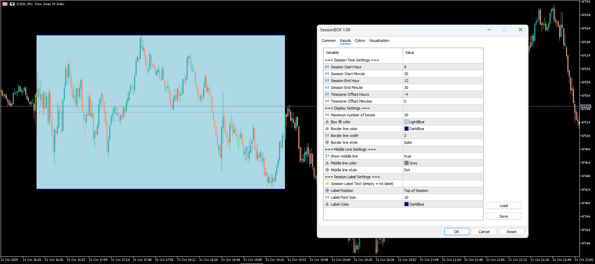

# Custom Session Indicator for MetaTrader 5

  <!-- === BADGES === -->
  <!-- These badges add a professional touch. You can create your own or modify these. -->
  
  
  
  

A flexible and highly customizable indicator for MetaTrader 5 (MT5) that allows you to draw session boxes for any time period directly on your chart. Designed to help traders visualize and analyze price action during specific trading hours with full timezone support.

  <!-- === HEADER IMAGE === -->
  <!-- Replace the src with the path to your uploaded image -->
  

---

## ✨ Key Features

*   **🎯 Fully Customizable Sessions:** Define the exact start and end time for any trading session (e.g., New York, London, Tokyo, or your own custom hours).
*   **🌍 Universal Timezone Support:** An intelligent timezone offset lets you track sessions from anywhere in the world, regardless of your broker's server time.
*   **🎨 Rich Visual Customization:** Control the colors, styles, and width of session boxes, borders, and the middle line to match your chart's theme.
*   **✍️ Session Labels:** Add custom text labels to your session boxes for quick identification.
*   **📈 Automatic High/Low Detection:** Automatically finds and plots the high and low within the defined session, creating key support and resistance levels.
*   **⚙️ Lightweight & Efficient:** Optimized to run smoothly without slowing down your MT5 platform.

---

## 🚀 Live Demo

A picture is worth a thousand words, but a GIF is worth a million! Here’s the indicator in action:

  <!-- === GIF DEMO === -->
  <!-- Create a short GIF showing the indicator being added to the chart and its features. -->
  <!-- Tools like ScreenToGif or GIPHY Capture are great for this. -->
  

---

## 🛠️ Installation & Setup

Getting started is simple. Follow these steps:

1.  **Download:** Grab the `CustomSession.mq5` file from this repository.
2.  **Install:**
    *   Open MetaTrader 5.
    *   Go to `File` > `Open Data Folder`.
    *   Navigate to `MQL5` > `Indicators`.
    *   Copy the `CustomSession.mq5` file into this folder.
3.  **Activate:**
    *   Restart MT5 or right-click on "Indicators" in the `Navigator` window and choose `Refresh`.
    *   Drag **"CustomSession"** from the Navigator onto your chart.
4.  **Configure:** Adjust the settings in the **"Inputs"** tab to match your trading strategy.

---

## ⚙️ Input Parameters

All parameters are fully configurable to suit your needs.

<strong>🕒 Session Time Settings</strong> (Click to expand)

| Parameter | Description | Default |
| :--- | :--- | :--- |
| `SessionStartHour` | The hour the session starts (0-23). | `9` |
| `SessionStartMinute` | The minute the session starts (0-59). | `30` |
| `SessionEndHour` | The hour the session ends (0-23). | `12` |
| `SessionEndMinute` | The minute the session ends (0-59). | `30` |
| `TimezoneOffsetHours` | The GMT offset for the session's timezone (e.g., `-4` for NY). | `-4` |
| `TimezoneOffsetMinutes`| The minute offset for the timezone. | `0` |

<strong>🎨 Display Settings</strong> (Click to expand)

| Parameter | Description | Default |
| :--- | :--- | :--- |
| `MaxBoxes` | The maximum number of historical session boxes to display. | `30` |
| `BoxColor` | The fill color of the session box. | `LightBlue` |
| `LineColor` | The color of the session box border. | `DarkBlue` |
| `LineWidth` | The width of the border lines. | `2` |
| `LineStyle` | The style of the border lines (Solid, Dash, Dot, etc.). | `STYLE_SOLID`|

<strong>✒️ Label & Middle Line Settings</strong> (Click to expand)

| Parameter | Description | Default |
| :--- | :--- | :--- |
| `ShowMiddleLine` | Show or hide the middle line of the session. | `true` |
| `MiddleLineColor` | The color of the middle line. | `Gray` |
| `MiddleLineStyle` | The style of the middle line. | `STYLE_DOT` |
| `SessionLabelText` | Custom text for the session label (empty = no label). | `""` |
| `LabelPosition` | Position of the label (Top, Middle, Bottom). | `LABEL_TOP` |
| `LabelFontSize` | The font size of the label text. | `10` |
| `LabelColor` | The color of the label text. | `DarkBlue` |

---

## 👤 Author

*   **CallMeAM**
*   **Telegram:** [https://t.me/amirmasoud_rsli](https://t.me/amirmasoud_rsli)

## 📜 License

This project is licensed under the MIT License. See the [LICENSE.md](LICENSE.md) file for details.
